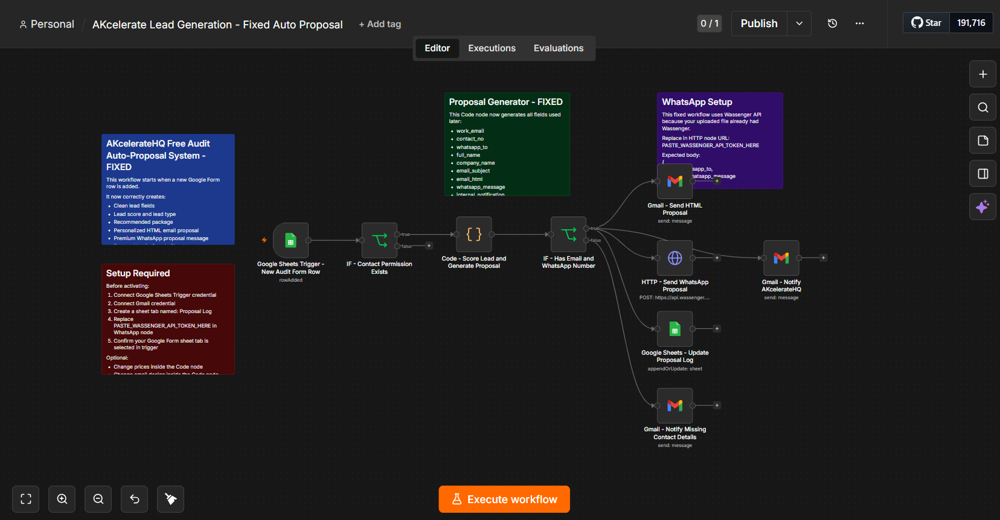

# AKcelerateHQ Free Audit Auto-Proposal System

This n8n workflow converts Google Form audit submissions into personalized HTML email and WhatsApp proposals using lead scoring and automated follow-up logging.

## Preview



## Problem

Service businesses often collect audit, consultation, or discovery form leads manually. After every inquiry, someone has to review the form, understand the pain points, decide whether the lead is hot or low priority, create a proposal, send follow-ups, update a tracker, and notify the team.

That process wastes time and makes it easy to miss good leads.

## Solution

This workflow automatically turns each audit form response into a structured proposal flow. It checks contact permission, scores the lead, classifies the lead type, creates a personalized HTML email proposal, sends a WhatsApp proposal message, updates the proposal log, and notifies AKcelerateHQ internally.

## Workflow Architecture

```text
Google Sheets Trigger
-> IF Contact Permission Exists
-> Code - Score Lead and Generate Proposal
-> IF Has Email and WhatsApp Number
-> Gmail - Send HTML Proposal
-> HTTP - Send WhatsApp Proposal
-> Google Sheets - Update Proposal Log
-> Gmail - Notify AKcelerateHQ
```

## Features

* Google Form to proposal automation
* Lead scoring
* Hot / Warm / Nurture lead classification
* HTML email proposal
* WhatsApp proposal through API
* Proposal log update
* Internal notification
* Public-safe JSON workflow

## Tech Stack

* n8n
* Google Sheets
* Gmail
* Wassenger / WhatsApp API
* JavaScript Code Node
* HTML Email

## Setup Instructions

1. Import `workflows/AKcelerateHQ_Free_Audit_Auto_Proposal_PUBLIC.json` into n8n.
2. Connect Google Sheets credentials to the trigger and proposal log nodes.
3. Connect Gmail credentials to the email notification nodes.
4. Replace `PASTE_WASSENGER_API_TOKEN_HERE` in the WhatsApp HTTP Request node inside n8n.
5. Replace `PASTE_GOOGLE_SHEET_ID_HERE` with your Google Form response sheet ID.
6. Create a `Proposal Log` sheet tab.
7. Confirm your Google Form response tab is named `Form Submission`, or update the trigger node.
8. Test with one dummy Google Form submission before activating the workflow.

## Google Sheet Columns

Required source and proposal log columns are documented in [docs/google-sheet-columns.md](./docs/google-sheet-columns.md).

## Use Cases

* Automation agency audit forms
* Free consultation forms
* Lead qualification systems
* Service proposal automation
* WhatsApp follow-up systems

## Resume Bullets

* Built an n8n automation that converts Google Form audit submissions into personalized HTML email and WhatsApp proposals.
* Implemented lead scoring, lead classification, proposal logging, and internal alerts using Google Sheets, Gmail, WhatsApp API, and JavaScript.
* Reduced manual proposal creation by automating lead qualification and follow-up communication for an AI automation agency.

## Launch Post

```text
Yesterday I visited a business and saw how much manual work they were doing after every inquiry.

So I built this in n8n:

Google Form audit submission
-> Lead scoring
-> Personalized HTML email proposal
-> WhatsApp proposal
-> Proposal log
-> Internal alert

This is the exact type of automation AKcelerateHQ builds for businesses that are tired of manual follow-ups.

Project is now live on GitHub.
```

## Disclaimer

This is a public portfolio version. API keys, credentials, customer data, and private sheet IDs are removed.
