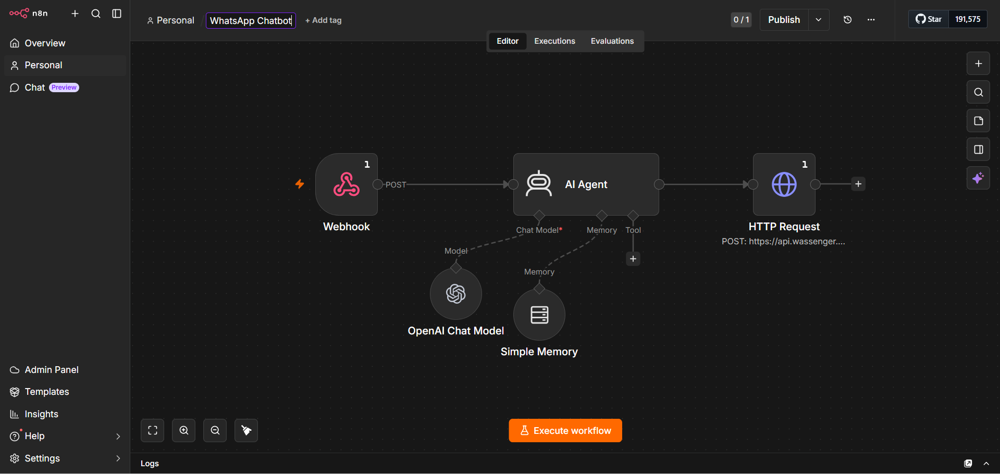

# AKcelerateHQ WhatsApp Chatbot

An AI-powered WhatsApp chatbot built in n8n for AKcelerateHQ, an AI workflow automation agency.

This chatbot helps qualify leads, answer business questions, explain services, share pricing information, and guide interested users toward a free automation audit.

## Preview



## What This Automation Does

* Receives WhatsApp messages through a webhook
* Sends the message to an AI Agent
* Uses memory to maintain conversation context
* Qualifies potential leads for automation services
* Explains AKcelerateHQ services in simple business language
* Shares pricing ranges when asked
* Collects lead details step by step
* Sends the AI-generated response back to WhatsApp using Wassenger API

## Tech Stack

* n8n
* WhatsApp API / Wassenger
* Webhook Trigger
* OpenAI Chat Model
* AI Agent
* Simple Memory
* HTTP Request Node

## Workflow Structure

```text
Webhook
↓
AI Agent
↓
HTTP Request
↓
WhatsApp Reply
```

## Lead Qualification Flow

The chatbot asks for:

* Name
* Business name
* Industry
* Phone number
* Email
* Website or social link
* Workflow problem
* Tools currently used
* Monthly lead volume
* Budget
* Timeline

It does not ask everything at once. It asks 2–3 questions at a time to keep the conversation natural.

## AKcelerateHQ Context

AKcelerateHQ helps businesses automate:

* Leads
* Replies
* Follow-ups
* CRM updates
* Dashboards
* Reports
* Repetitive manual work

## Pricing Used in Chatbot

* First-time audit and consultation: Free
* Builder: Starts from ₹15,000 / $180 one-time
* Maintenance: Starts from ₹5,000 / $60 per month per workflow
* Builder + yearly Maintenance: 17% discount with minimum 3 months payment upfront
* Enterprise: Custom pricing

## Setup Instructions

1. Import the JSON workflow into n8n.
2. Connect your OpenAI credentials.
3. Connect your WhatsApp provider or Wassenger API.
4. Replace PASTE_WASSENGER_API_TOKEN_HERE with your actual token inside n8n only.
5. Set up the webhook URL in your WhatsApp provider dashboard.
6. Test the chatbot with a WhatsApp message.
7. Publish the workflow after successful testing.

## Important Security Note

Do not commit real API keys, tokens, webhook secrets, private credential IDs, or client data to GitHub.

Before making this repo public, rotate any token that was previously exposed in a workflow file.

## Project Outcome

This project demonstrates how an AI automation agency can use a WhatsApp chatbot to capture, qualify, and guide leads automatically using n8n and LLMs.
