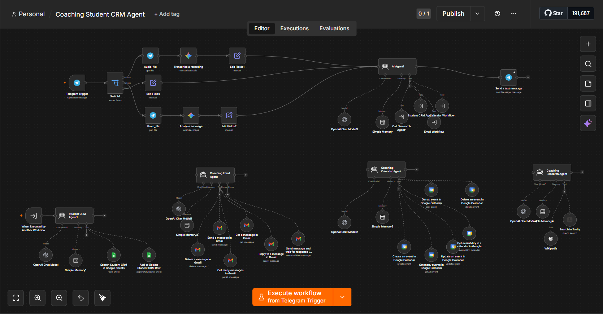

# Coaching Owner AI Assistant

An end-to-end multi-agent n8n automation system built for coaching class owners, tuition centers, course creators, and training institutes.

This AI assistant helps coaching businesses manage student inquiries, demo class scheduling, parent communication, student follow-ups, fee reminders, class calendar events, and academic research from a Telegram-based interface.

## Preview



## Project Type

This project includes two versions:

### 1. End-to-End All-in-One Workflow

File:

workflows/00_Coaching_Student_CRM_Agent_End_to_End.json

This is the complete working version in one n8n workflow. It includes:

* Telegram input
* Text, voice, and photo handling
* AI routing agent
* Student CRM Agent
* Email Agent
* Calendar Agent
* Research Agent
* Google Sheets integration
* Gmail integration
* Google Calendar integration
* Tavily Search
* Wikipedia Tool
* Final Telegram response

### 2. Modular Agent Workflows

Files:

* workflows/01_Coaching_Owner_Main_Workflow.json
* workflows/02_Coaching_Student_CRM_Agent.json
* workflows/03_Coaching_Email_Agent.json
* workflows/04_Coaching_Calendar_Agent.json
* workflows/05_Coaching_Research_Agent.json

These files show the same system in a modular multi-agent architecture.

## What This Automation Does

* Captures student and parent inquiries
* Manages student CRM records in Google Sheets
* Schedules demo classes and parent meetings in Google Calendar
* Sends emails for demo confirmation, follow-ups, and fee reminders
* Reads and replies to coaching-related emails
* Generates lesson plans, worksheets, and academic research
* Supports Telegram text, voice, and image input
* Routes tasks automatically to the correct AI agent
* Works as an end-to-end coaching business operations assistant

## Tech Stack

* n8n
* Telegram Bot API
* OpenAI / Gemini
* Google Sheets
* Gmail
* Google Calendar
* Tavily Search
* Wikipedia Tool
* Multi-agent workflow architecture

## Workflow Structure

```text
Telegram Input
|
Voice / Text / Image Detection
|
Main Coaching Routing Agent
|
Student CRM Agent
Email Agent
Calendar Agent
Research Agent
|
Final Telegram Response
```

## Agents Included

### 1. Main Coaching Routing Agent

Routes user requests to the correct sub-agent based on intent.

### 2. Student CRM Agent

Handles student inquiries, lead status, demo status, fee status, batch assignment, and follow-up tracking using Google Sheets.

### 3. Email Agent

Sends coaching-related emails such as demo confirmations, fee reminders, parent updates, and follow-up messages.

### 4. Calendar Agent

Creates and manages demo classes, parent meetings, batch schedules, revision sessions, and follow-up calls.

### 5. Research Agent

Creates worksheets, lesson plans, syllabus research, exam updates, and academic explanations.

## Google Sheet Columns

The Student CRM sheet should include:

* Student_ID
* Student_Name
* Parent_Name
* Phone
* Email
* City
* Class_Grade
* Course_Interest
* Exam_Target
* Lead_Source
* Lead_Status
* Demo_Status
* Demo_Date
* Follow_Up_Date
* Batch_Assigned
* Fee_Status
* Amount_Pending
* Last_Contacted
* Next_Action
* Notes
* Created_At
* Updated_At

## Example Use Cases

* Add Rahul as a new inquiry for Class 10 Maths.
* Schedule demo class for Priya tomorrow at 5 PM.
* Send fee reminder to Aarav's parent.
* Show all pending follow-ups for today.
* Create 20 worksheet questions for Class 9 algebra.
* Analyze a homework photo sent on Telegram.
* List hot leads from the Student CRM.
* Schedule a parent meeting and send confirmation email.

## Files

### End-to-End Version

* workflows/00_Coaching_Student_CRM_Agent_End_to_End.json

### Modular Version

* workflows/01_Coaching_Owner_Main_Workflow.json
* workflows/02_Coaching_Student_CRM_Agent.json
* workflows/03_Coaching_Email_Agent.json
* workflows/04_Coaching_Calendar_Agent.json
* workflows/05_Coaching_Research_Agent.json

### Supporting Files

* assets/coaching-owner-workflow-preview.png
* docs/Coaching_Student_CRM_Sheet_Columns.csv

## Setup Instructions

1. Import the end-to-end JSON workflow into n8n for the fastest setup.
2. Alternatively, import the modular workflow files if you want a cleaner multi-agent architecture.
3. Connect Telegram credentials.
4. Connect OpenAI or Gemini credentials.
5. Connect Gmail credentials.
6. Connect Google Calendar credentials.
7. Connect Google Sheets credentials.
8. Connect Tavily credentials.
9. Replace the placeholder Google Sheet ID with your own CRM sheet ID.
10. Make sure the Google Sheet tab name is Students.
11. Test with Telegram messages.

## Important Security Note

Before using or sharing publicly, make sure no API keys, private credentials, personal tokens, webhook secrets, private spreadsheet links, or client data are included in the workflow files.

## Project Outcome

This project demonstrates how AI agents can automate real coaching business operations using n8n, Google Workspace, Telegram, and LLMs. It shows both an end-to-end all-in-one workflow and a modular multi-agent architecture.
